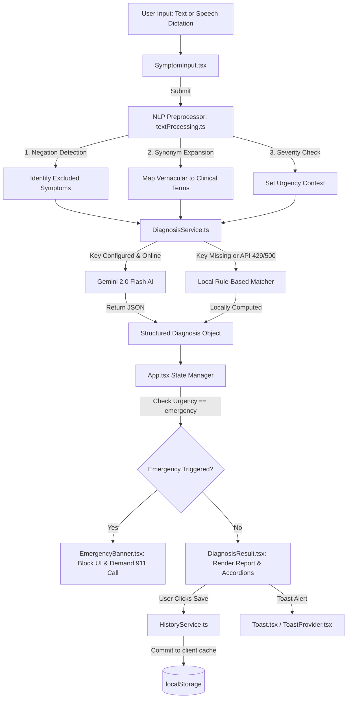

# 🏥 AI-Powered Health Assistant
> **Enterprise-Grade Triage System & Symptom Analysis Platform**

[](https://react.dev/)
[](https://www.typescriptlang.org/)
[](https://vitejs.dev/)
[](https://tailwindcss.com/)
[](https://ai.google.dev/)
[](https://opensource.org/licenses/MIT)

An elite, client-side, privacy-first **AI Health Assistant** that leverages **Google Gemini 2.0 Flash** for state-of-the-art medical triage and symptom analysis. Designed with a premium **glassmorphism dark-mode UI**, the platform features real-time Web Speech dictation, smart NLP preprocessing, persistent health history, and automatic emergency detection.

---

## 🚨 IMPORTANT MEDICAL DISCLAIMER

> [!WARNING]  
> **This platform is for informational and educational purposes only.**  
> It does **not** provide medical advice, diagnosis, or treatment. Always consult a qualified healthcare professional or call emergency services (911) immediately in the event of severe symptoms. This project serves as a showcase of modern AI triage flow integration.

---

## 🌟 Premium Features Showcase

### 🧠 Dual-Engine Hybrid Diagnostics
The application implements a unique, fail-safe architecture. If the Google Gemini API key is missing or encounters a `429 Too Many Requests` (Quota Exceeded) or `500 Server Error`, the app transparently shifts to a **Local Rule-Based Preprocessor**. The user experience remains uninterrupted, showing an status badge: **"Using Offline Analysis"** vs **"Gemini AI Connected"**.

### 🎤 Real-time Web Speech Transcription
Integrates natively with the browser's **Speech Recognition API** (Chrome/Edge) to convert speech-to-text dynamically inside the input editor. Includes a pulsing red microphone indicator mirroring professional medical telemetry devices.

### 🔒 Privacy-First Persistence
No personal health details are stored on any backend database. All symptoms, diagnoses, timestamps, and feedback flags are saved directly within the browser's client-side `localStorage`.

### 🚨 Automatic Emergency Triaging
Matches user inputs against a high-priority emergency dictionary (e.g., chest pain, shortness of breath, slurred speech). Staging emergency symptoms halts normal outputs and renders an unmissable red warning banner requesting the user to contact local emergency response immediately.

---

## 🗺️ Architectural Flowcharts

### 1. Unified System Dataflow
The diagram below outlines how symptom descriptions transition from input validation through pre-processing, execute parallel AI or fallback matching, and persist in storage.



### 2. Diagnosis Service Logic Pipeline
A detailed view of how [DiagnosisService.ts](file:///c:/Users/srira/Project/AI-Powered-Health-Assistant/src/services/DiagnosisService.ts) handles fallback scenarios.

```
                  [Start Triage Request]
                            │
               Is VITE_GEMINI_API_KEY set?
               /                         \
            (Yes)                        (No)
             │                             │
    [Attempt API call]                     │
    [Model: gemini-2.0-flash]              │
             │                             │
       Did it succeed?                     │
       /             \                     │
    (Yes)            (No / 429 / 500)      │
     │                       │             │
[Parse AI JSON]       [Log error code]     │
     │                       └──────┬──────┘
     │                              ▼
     │                 [Execute local preprocessor]
     │                 [Match symptoms via keywords]
     │                 [Compute relative confidence]
     ▼                              ▼
 [Output Diagnosis]            [Output Local Match]
[Badge: Gemini AI]            [Badge: Offline fallback]
```

---

## 🛠️ Advanced Technology Stack

| Component | Technology | Benefit |
| :--- | :--- | :--- |
| **Core Engine** | React 18.3 & TypeScript 5.0 | High performance, modular components, strict type-safety. |
| **Compiler & Server**| Vite 5.4 | Sub-second Hot Module Replacement (HMR) and optimized build bundles. |
| **Styling Framework**| Tailwind CSS 3.4 | Utility-first responsive spacing and custom animation utilities. |
| **Animations** | Framer Motion 12.0 | Hardware-accelerated entry, collapse transitions, and toast alerts. |
| **AI Integration** | `@google/generative-ai` | Secure connection to Gemini's multimodal endpoints. |
| **Dictation Engine** | Web Speech API | Zero-latency, browser-native speech-to-text without extra downloads. |
| **Persistence** | LocalStorage API | Complete confidentiality; data never leaves the client's device. |

---

## 📂 Source Code Structure

All modules follow a clean **Layered Concerns Architecture**:

```
AI-Powered-Health-Assistant/
├── .env.example                    # Template for secure API environment configuration
├── .gitignore                      # Configured to strictly block private keys (.env)
├── index.html                      # SEO optimized metadata with Open Graph templates
├── package.json                    # Metadata configuration and script definitions
├── tailwind.config.js              # Extended tokens (animations, glassmorphic styling)
└── src/
    ├── App.tsx                     # Core state coordinator and layout structure
    ├── types.ts                    # Application TypeScript schemas and interfaces
    ├── index.css                   # Custom utility variables and global styles
    ├── components/
    │   ├── Header.tsx              # Pulse logo with Gemini connectivity status
    │   ├── Footer.tsx              # Medical disclaimer footer and metadata indicators
    │   ├── SymptomInput.tsx        # Multi-input form (text, voice, severity toggle)
    │   ├── SymptomSuggestions.tsx  # Staggered pill buttons for common conditions
    │   ├── DiagnosisResult.tsx     # Differential diagnosis report cards
    │   ├── DisclaimerModal.tsx     # Dynamic health advisory gatekeeper modal
    │   ├── HistoryPanel.tsx        # Local database sidebar with deletion actions
    │   ├── LoadingAnalysis.tsx     # Animated telemetry scanner simulation
    │   ├── EmergencyBanner.tsx     # Pulsing red lock screen for acute clinical cases
    │   └── Toast.tsx               # Status toasts with progress timelines
    ├── hooks/
    │   ├── useSpeechRecognition.ts # Native Speech Recognition coordinator hook
    │   └── useToast.ts             # Global notification hook
    ├── services/
    │   ├── DiagnosisService.ts     # Gemini API integrator and fallback engine
    │   └── HistoryService.ts       # LocalStorage data persistence layer
    └── utils/
        └── textProcessing.ts       # NLP preprocessor (Negation & Synonym expander)
```

---

## ⚙️ Development Setup

Follow these steps to run the application locally on your system.

### Prerequisites
- **Node.js** v18 or newer
- **npm** (comes packaged with Node)
- A modern web browser (Google Chrome or Microsoft Edge is required for voice dictation)

### 1. Clone the Codebase
```bash
git clone https://github.com/sriram21-09/AI-Powered-Health-Assistant.git
cd AI-Powered-Health-Assistant
```

### 2. Install Project Dependencies
```bash
npm install
```

### 3. Configure the Environment
Create a `.env` file in the project's root folder:
```bash
# Copy template configuration
cp .env.example .env
```
Open the `.env` file and insert your API key:
```env
VITE_GEMINI_API_KEY=your_actual_gemini_api_key_here
```
> [!TIP]
> You can acquire a free, zero-cost API key from the [Google AI Studio Console](https://aistudio.google.com/apikey).

### 4. Boot the Hot-Reloading Development Server
```bash
npm run dev
```
Navigate to the hosted port (usually `http://localhost:5173/`).

### 5. Production Compilation
Verify compiling builds for deployment with:
```bash
npm run build
```

---

## 🧪 Deep Dive: NLP Preprocessing Engine
Before sending text queries to the Gemini API or the Fallback engine, [textProcessing.ts](file:///c:/Users/srira/Project/AI-Powered-Health-Assistant/src/utils/textProcessing.ts) processes inputs using these sub-systems:

### A. Negation Processor
Identifies qualifiers like "no", "not", "without", "never", "free of".
- **Input:** *"I have severe chest pain but no fever."*
- **Result:**
  - Positive Symptom Match: `chest pain` (triggery for emergency checks)
  - Excluded/Negated Symptom: `fever` (informs the diagnosis engine to ignore cold/flu differentials)

### B. Synonym Expansion Dictionary
Maps common colloquialisms to clinical nomenclature:
```typescript
const SYNONYM_MAP: Record<string, string> = {
  'tummy ache': 'abdominal pain',
  'belly ache': 'abdominal pain',
  'sore head': 'headache',
  'blocked nose': 'nasal congestion',
  'hard to breathe': 'dyspnea',
  'throwing up': 'vomiting'
};
```

---

## 📡 API Structured Response Contract
The Gemini API model is constrained to return a strict, parsable JSON schema to avoid typical conversational outputs. Below is the precise schema handled by [DiagnosisService.ts](file:///c:/Users/srira/Project/AI-Powered-Health-Assistant/src/services/DiagnosisService.ts):

```json
{
  "condition": "Primary diagnosed condition name",
  "confidence": 0.85,
  "possibleConditions": [
    {
      "name": "Condition Name",
      "confidence": 0.85,
      "description": "Clinical justification mapping matched inputs to literature."
    }
  ],
  "recommendations": [
    "Actionable self-care step (e.g. stay hydrated)",
    "Clinical check (e.g. consult physician)"
  ],
  "shouldSeeDoctor": true,
  "severity": "low | medium | high",
  "urgencyLevel": "routine | soon | urgent | emergency",
  "followUpQuestions": [
    "Clinical check question to narrow down variables"
  ],
  "lifestyleTips": [
    "General wellness guidelines"
  ]
}
```

---

## 🏆 Project Accomplishments & Quality Metrics

1. **Accessibility Standards:** Compliant with WCAG 2.1 AA standards, utilizing semantic tags, structured headers, visual indicator keyboard outlines (`focus-visible`), and accessibility descriptors (`aria-label`).
2. **Bundle Optimization:** Zero-bloat libraries. Relies strictly on browser native features for Voice-to-Text and Data Storage.
3. **Advanced Micro-Interactions:** Custom toast alerts, loading skeleton placeholders, dynamic status rings, and collapsible panels to maximize UI feedback metrics.

---
🚑 **AI-Powered Health Assistant** — Developed to showcase advanced web design, modern API integration, and user-centric software architecture.
