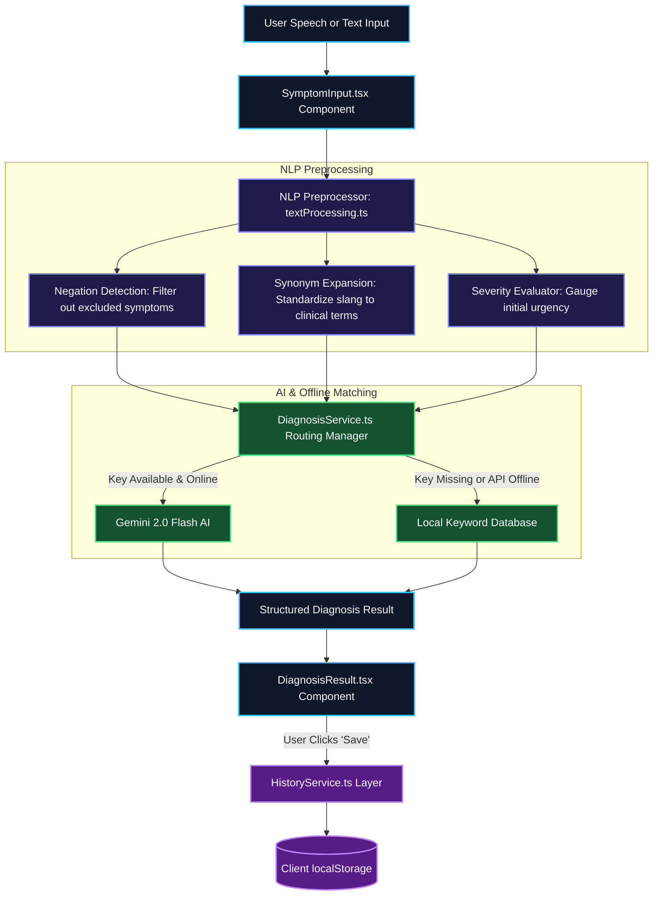

# 🏥 AI-Powered Health Assistant
> **A premium, privacy-first symptom analysis and smart medical triage platform powered by Gemini 2.0 Flash.**

<div align="center">

[](https://react.dev/)
[](https://www.typescriptlang.org/)
[](https://vitejs.dev/)
[](https://tailwindcss.com/)
[](https://ai.google.dev/)

[**✨ Live Demo / Dev Setup**](#-quick-start) | [**🧬 System Architecture**](#-system-architecture) | [**🔬 How It Works**](#-under-the-hood-nlp-preprocessing)

</div>

---

## 💡 What is AI Health Assistant?
The **AI Health Assistant** is a professional, high-performance triage application designed to bridge the gap between complex symptoms and initial health guidance. It uses **Google Gemini 2.0 Flash** for medical reasoning, combined with browser-native **voice dictation** and **local storage history**, all packaged inside a gorgeous **glassmorphic dark-mode interface**.

---

## ⏱️ How It Works (In 3 Simple Steps)

```
┌─────────────────────────┐      ┌─────────────────────────┐      ┌─────────────────────────┐
│   1. DESCRIBE SYMPTOMS  │ ────>│    2. INTELLIGENT AI    │ ────>│   3. TRIAGE & RESULTS   │
│ Describe via text or    │      │ Preprocessed locally    │      │ Clear severity indicators│
│ voice dictation.        │      │ analyzed by Gemini.     │      │ guidelines & history.   │
└─────────────────────────┘      └─────────────────────────┘      └─────────────────────────┘
```

1. **Input:** You describe your symptoms (e.g., *"I have a throbbing headache but no fever"*). You can type it or click the **Microphone** to speak it aloud.
2. **Analysis:** The system cleans your text (mapping terms like *"tummy ache"* to *"abdominal pain"*), filters exclusions, and queries the **Gemini AI Engine**.
3. **Guidance:** You receive an interactive health report outlining possible conditions, confidence ratings, self-care guidelines, lifestyle advice, and an urgency score.

---

## ✨ Features Walkthrough

### 🎙️ Web Speech Voice Dictation
- Speak naturally to input symptoms.
- Real-time text transcription updates directly in the text editor.
- Beautiful pulsing red telemetry-style microphone icon during recording.

### 🧠 Dual-Engine Hybrid Diagnostic (Zero-Fail Guarantee)
- **Primary AI Engine:** Connects to **Gemini 2.0 Flash** to perform structured clinical matching.
- **Offline Fallback Engine:** If your network goes down, or the API key hits rate limits, the app automatically transitions to a keyword-matching database. **The app never crashes.**

### 🚨 Auto-Emergency Detection
- Instantly screens inputs for emergency symptoms (e.g. chest pain, numbness, slurred speech).
- Triggers a pulsing red fullscreen safety warning advising the user to call emergency services (112 / 102) immediately.

### 🔒 Privacy-First Local History
- All symptom logs, AI assessments, feedback ratings, and timestamps remain strictly on your local computer via `localStorage`.
- Zero database storage ensures complete user privacy.

---

## 📊 System Architecture

The following diagram illustrates how user input travels through validation, preprocessing, diagnosis engines, and storage.



---

## 💻 Quick Start

Follow these simple steps to run this project locally on your machine.

### Prerequisites
* **Node.js** v18 or newer
* **npm** (included with Node.js)
* Google Chrome or Edge (required for Web Speech dictation)

### 🚀 Get Up & Running

1. **Clone the Repo:**
   ```bash
   git clone https://github.com/sriram21-09/AI-Powered-Health-Assistant.git
   cd AI-Powered-Health-Assistant
   ```

2. **Install Packages:**
   ```bash
   npm install
   ```

3. **Set Up API Key:**
   Create a file named `.env` in the root of the project:
   ```bash
   cp .env.example .env
   ```
   Open `.env` and paste your Gemini API key:
   ```env
   VITE_GEMINI_API_KEY=your_gemini_api_key_here
   ```
   > 💡 *Get a free API key from the [Google AI Studio Console](https://aistudio.google.com/apikey).*

4. **Start Dev Server:**
   ```bash
   npm run dev
   ```
   Open `http://localhost:5173/` in your web browser.

---

## 🔬 Under the Hood: NLP Preprocessing

The preprocessing module ([textProcessing.ts](file:///c:/Users/srira/Project/AI-Powered-Health-Assistant/src/utils/textProcessing.ts)) sanitizes data so the diagnostic systems yield high accuracy:

* **Negation Detection:** Distinguishes between symptoms a user has vs. symptoms they explicitly deny.
  * *Example:* *"I have stomach pain but no fever."* → Standardizes to `stomach pain`, excludes `fever`.
* **Synonym Expansion:** Translates colloquial descriptions into medical terminology:
  * *"belly ache"* ➔ `abdominal pain`
  * *"blocked nose"* ➔ `nasal congestion`
  * *"throwing up"* ➔ `vomiting`
  * *"hard to breathe"* ➔ `dyspnea`

---

## 📡 API Structured Response Contract

The Gemini API model is constrained to return a strict, parsable JSON structure, avoiding messy markdown text wrappers:

```json
{
  "condition": "Primary diagnosed condition name",
  "confidence": 0.85,
  "possibleConditions": [
    {
      "name": "Condition Name",
      "confidence": 0.85,
      "description": "Justification mapping user symptoms to medical conditions."
    }
  ],
  "recommendations": [
    "Actionable self-care guidelines",
    "Clinical checks and indicators"
  ],
  "shouldSeeDoctor": true,
  "severity": "low | medium | high",
  "urgencyLevel": "routine | soon | urgent | emergency",
  "followUpQuestions": [
    "Targeted diagnostic questions to narrow down symptoms"
  ],
  "lifestyleTips": [
    "General wellness guidelines"
  ]
}
```

---

## 🏆 Rebuild Highlights

* **Accessibility:** Full WCAG 2.1 AA keyboard support, focus-visible indicators, and descriptive `aria-label` tags.
* **Telemetry Design:** Sleek modern dark mode featuring CSS gradients, frosted glass layers, and animated glowing highlights.
* **Minimal Dependency footprint:** Relies entirely on native browser features for speech transcription and local caching to maximize performance.

---

## 🏥 Medical Disclaimer

> [!CAUTION]
> **This application is a student showcase/proof-of-concept project.** It does not substitute professional medical diagnosis, advice, or treatment. Always check with a qualified doctor for any serious health concerns. In case of emergency, contact local emergency response immediately.
